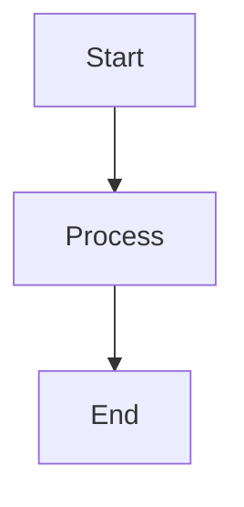

# Documentation Guide

This guide provides information on how to maintain and enhance the Ragatanga documentation.

## Documentation Structure

The documentation is built using MkDocs with the Material theme and several enhancements:

- **API Documentation**: Automatically generated using mkdocstrings
- **Diagrams**: Interactive diagrams using Mermaid.js
- **Versioning**: Document versioning using mike
- **Search**: Enhanced search functionality
- **Examples**: Real-world usage examples

## Building the Documentation

To build and serve the documentation locally:

```bash
# Install dependencies
pip install mkdocs mkdocs-material mkdocstrings mkdocstrings-python mike

# Serve documentation locally (for development)
mkdocs serve

# Build documentation
mkdocs build
```

## Versioning Documentation

The documentation uses mike for versioning. This allows you to maintain documentation for multiple versions of Ragatanga.

### Creating a New Version

To create a new version of the documentation:

```bash
# Deploy a new version
mike deploy [version]

# Example: Deploy version 0.3.1 and set it as the latest
mike deploy 0.3.1 latest

# Set the default version (shown when no version is specified)
mike set-default latest
```

### Updating Existing Versions

To update an existing version of the documentation:

```bash
# Update a specific version
mike deploy [version] --update

# Example: Update version 0.3.1
mike deploy 0.3.1 --update
```

## Deploying to GitHub Pages

The documentation can be deployed to GitHub Pages in two ways:

1. **Automatically**: Through GitHub Actions workflows
   - `deploy-docs.yml`: Deploys the latest documentation when changes are pushed to main
   - `versioned-docs.yml`: Deploys versioned documentation when a release is published

2. **Manually**: Using the following command:
   ```bash
   mike deploy [version] --push
   ```

## Adding Content

### Adding New Pages

1. Create a new Markdown file in the `docs` directory
2. Add the file to the navigation in `mkdocs.yml`:
   ```yaml
   nav:
     - Home: index.md
     - Your New Page: your-new-page.md
   ```

### Adding Diagrams

Add diagrams using Mermaid.js:



### Adding API Documentation

Update the API reference with docstrings from your code:

```markdown
::: ragatanga.your.module.YourClass
    options:
      show_root_heading: true
      show_source: true
      members: true
```

## Enhanced Features

### Improved Search

The documentation includes enhanced search functionality:

- Syntax highlighting in search results
- Search suggestions
- Search sharing
- Full text indexing

### Additional Features

- **Code Annotations**: Add annotations to code examples
- **Linked Content Tabs**: Link tabs with the same labels
- **Social Cards**: Generated social media cards
- **Analytics**: Google Analytics integration (requires setting `GOOGLE_ANALYTICS_KEY`)
- **Minification**: HTML minification for faster loading

## Maintenance Checklist

- [ ] Update documentation when adding new features
- [ ] Maintain proper versioning
- [ ] Ensure API documentation is up-to-date
- [ ] Add diagrams for new architectural components
- [ ] Add examples for new functionality
- [ ] Check for broken links periodically
- [ ] Optimize search keywords and metadata 