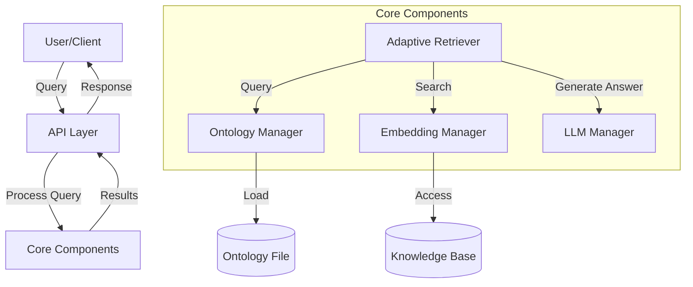
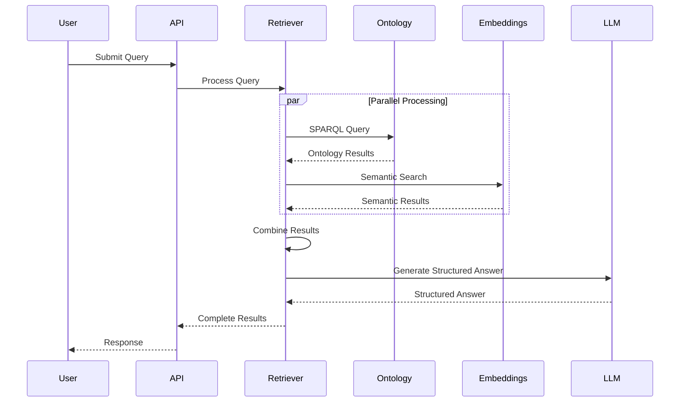
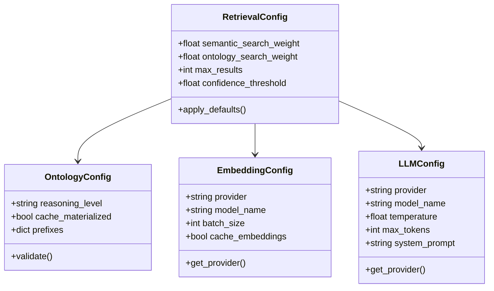
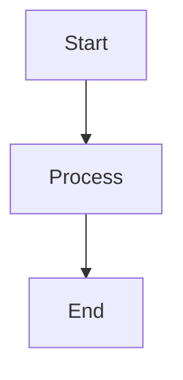

# Diagrams

This page demonstrates how to use diagrams to better explain Ragatanga's architecture and workflow.

## System Architecture

The following diagram illustrates the high-level architecture of Ragatanga:



## Data Flow

The following diagram illustrates the data flow during a query:



## Configuration Components

The following diagram shows the configuration components:



## Adding Your Own Diagrams

You can add your own diagrams to the documentation using Mermaid.js. Here's how:

1. Add the Mermaid extension to your `mkdocs.yml`:

```yaml
markdown_extensions:
  - pymdownx.superfences:
      custom_fences:
        - name: mermaid
          class: mermaid
          format: !!python/name:pymdownx.superfences.fence_code_format
```

2. Create your diagram using Mermaid syntax:

```

```

3. You can create various types of diagrams:
   - Flowcharts (`graph TD` or `graph LR`)
   - Sequence diagrams (`sequenceDiagram`)
   - Class diagrams (`classDiagram`)
   - Entity Relationship diagrams (`erDiagram`)
   - Gantt charts (`gantt`)
   - State diagrams (`stateDiagram-v2`) 